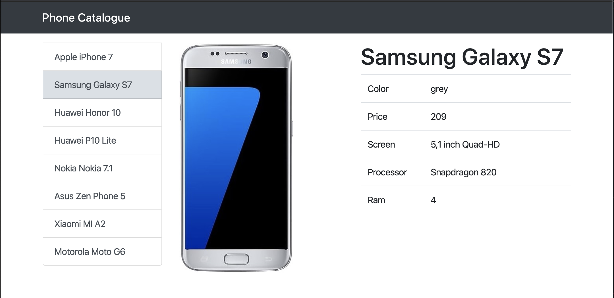

# Phone Catalogue

This project is a ténical challenge as part of my inteview process with Guidesmiths.



## Tools

- [NodeJS] - Javascript runtime
- [ReactJS] - Javascript library for building user interfaces

---

## Getting Started

These instructions will get your app up and running.

### Prerequisites

The following software is required to be installed on your system:

- NodeJS

  The following version of Node and Npm are required:

  - Node 8.x
  - Npm 3.x

  Type the following commands in the terminal to verify your node and npm versions

  ```bash
  node -v
  npm -v
  ```

## Install

Follow the following steps to get development environment running.

1. Clone 'guaurderia/app' repository from GitHub

   ```bash
   git clone https://github.com/guaurderia/app.git
   ```

   _or using ssh_

   ```bash
   git clone git@github.com:guaurderia/app.git
   ```

2. Once you have downloaded the repository you will need to install the server and cliente dependencies.

### Build Server

In the terminal, go to the root path of the app and run the following commands:

```bash
cd server
npm install
npm start
```

[Optional]

To change the default server behaviour you can create an `.env` file in server root path to declarte the server variables:

```bash
vim .env
```

Example of server variables:

```bash SERVER_PORT=3000 CLIENT_PORT=1234

```

Once `.env` file is in place, to start the server follow [build instructions](#Build-server)

### Client

To start the app, follow the next instructions:

Start React app

```javascript
cd client
npm install
npm start
```

---

### Run App

Once you have started the server and client servers, open you web browser to http://localhost:1234 (or the port you have manually configured)
