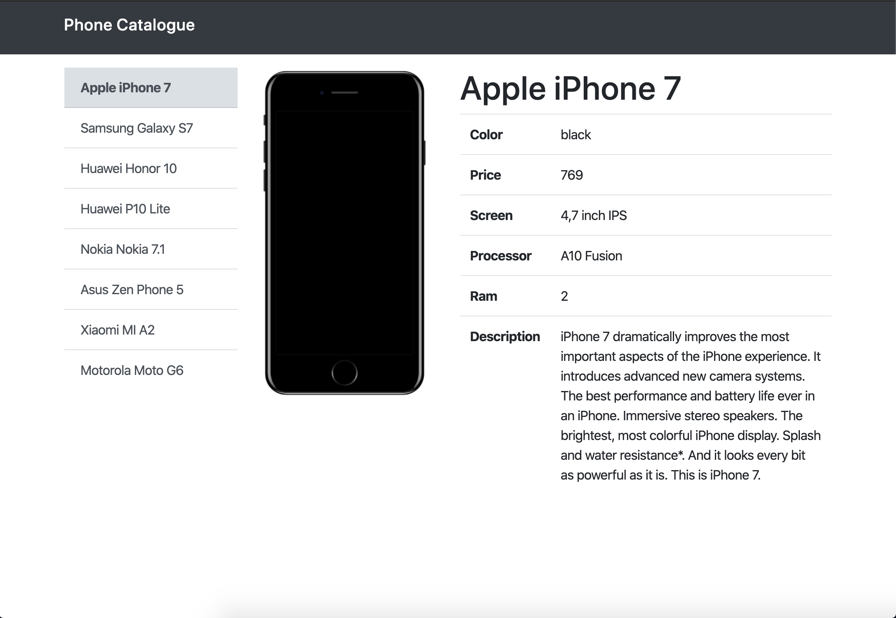

# Phone Catalogue

This project is a ténical challenge as part of my inteview process with Guidesmiths.



## Tools

- [NodeJS] - Javascript runtime
- [ReactJS] - Javascript library for building user interfaces

## Getting Started

These instructions will get your app up and running.

### Prerequisites

The following software is required to be installed on your system:

  - Node 8.x

Type the following commands in the terminal to verify your node versions

  ```bash
  node -v
  ```
You can download NodeJS here: https://nodejs.org/en/download/

## Install App

Follow the following steps to get development environment running.

1. Clone 'phone-catalogue' repository from GitHub to your local directory using the following terminal command:

   ```bash
   git clone https://github.com/romanmendez/phone-catalogue.git
   ```

2. Once you have downloaded the repository you will need to `cd` into the `/server` path of the repository to install the server dependencies:

```bash
cd server
npm install
```

3. After intalling the server dependencies, go back to the root of the repository and `cd` into the `/client` path to install the client dependencies:

```bash
cd client
npm install
```

4. You are now ready to run both `server` and `client` server. Open two terminal instances, one in `/client` and the other in `/server` and run the start command in both:

```bash
npm start
```

*[Optional]*

*To change the default server behaviour you can create an `.env` file in server root path to declarte the server variables:*

```bash
vim .env
```

*Example of server variables:*

```bash
SERVER_PORT=3000
CLIENT_PORT=1234

```

## Run App

Once you have started the server and client servers, open you web browser to http://localhost:1234 (or the port you have manually configured)
